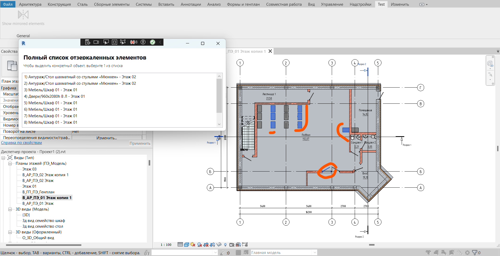

# Плагин для опеределения наличия отзеркаленных элементов в документе
# Revit 2022

## Описание работы
Надстройка для ревита позволяет выделить все отзеркаленные элементы в текущем документе. 
 1) По нажатии кнопки на вкладке `Test` отзеркаленные объекты выделяются на всех видах.
 2) Всплывает окно со списком информации по найденным элементам: `Категория/Наименование - Уровень`
 3) При нажатии на одну или несколько строк списка, выделятся только соответствующие объекты, что поможет уточнить поиск среди одинаковых элементов.
Все выделенные элементы являются объектами класса FamilyInstance

#### Пример работы плагина:
1) Откройте вид, который хотите проверить, и нажмите кнопку `Show mirrored elements` на вкладке `Test`.

	

2) На открытом виде выделяются все отзеркаленные элементы

	

3) Можно выделить только некоторые элементы из списка, чтобы не запутаться в объектах с одинаковыми наименованиями

	

<!-- 
<video controls src="content/plugin_7_03.mp4" title="Title"></video>
 -->

 ## Установка
 Есть два варианта установки плагина. Если вы не планируете редактировать исходный код, то можете просто скачать и скопировать файлы из директории `bin/Debug`, а именно .dll, .addin и .png в папку AddIns вашего ревита и запустить ревит.
 Для установки запуска проекта целиком необходимо клонировать репозиторий на локальный компьютер, на котором установлен ревит 2022 года.
  1) Открыть решение (`RevitPlugIn.sln`) в VisualStudio
  2) В случае, если у вас ревит не 22 года, открыть свойства проекта, вкладку `Build Events`, в поле `Post-build event` уточнить адрес папки с надстройками для вашего ревита
  3) Собрать и запустить решение из IDE. В дальнейшем можно будет просто открывать ревит сразу, до следующей сборки и обновления файла .dll

 
